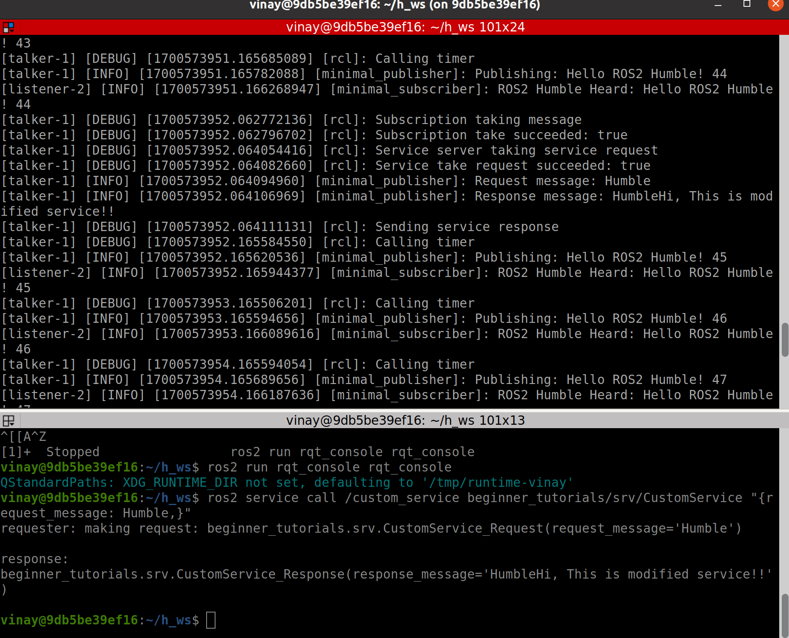

## ROS2 programming exercises - Publisher/Subscriber
Using ROS2 Humble and Object oriented approach in C++ to achieve multiple functionalities as below
1. Creation of simple publisher and subscriber to print custom message
2. Modify the simple publsiher for creation of a service to perform request and response through a service
3. Modify the publisher to get the tf frames when broadcasted to a static frame publisher. Also, record
the data using rosbag

### Building the ROS package
```bash
# Source to ros humble
source /opt/ros/humble/setup.bash
# Go to the source directory of your ros2 workspace
cd ~/ros2_ws/src
git clone https://github.com/vinay06vinay/beginner_tutorials.git

# Once files are checked, go back to the root directory of ros workspace
cd ..
# Install rosdep dependencies before building the package
rosdep install -i --from-path src --rosdistro humble -y
# Build the package using colcon build
colcon build --packages-select beginner_tutorials
# After successfull build source the package
. install/setup.bash
# Run the publisher 
ros2 run beginner_tutorials talker
# Run the subscriber
ros2 run beginner_tutorials listener 
```
**Run below commands to check the functionality of the Service Created**
```bash
# Using launch file to run both talker and listener together with custom frequency (Terminal 1)
ros2 launch beginner_tutorials launch.py frequency:=1.0

# Calling the service with modified request message (Terminal 2)
ros2 service call /custom_service beginner_tutorials/srv/CustomService "{request_message: Humble}"

```
**Run below commands to check the functionality of the Rosbag**
```bash
# Using launch file to run both talker and listener together with rosbag option true.(Terminal 1)
# You can set to false if you dont want to record the messages
ros2 launch beginner_tutorials bag_recorder_launch.launch.py record_bag:=True
# Press Ctrl+C after 15 seconds

# To view the rosbag info. Be in the current directory only
ros2 bag info bag_list
# To play the rosbag. Check the rosbag file name [Terminal 2]
cd bag_list
ros2 bag play ["ros bag file name"]
# Alternatively you can go inside the results folder where the recorded bag file is present and run above commands
# Run the listener node to get the recorded messages
ros2 run beginner_tutorials listener
```
**Run below commands to check the functionality of the Ros2 TF Frames**
```bash
# Using launch file to run both talker and listener together with rosbag option true and freq(Terminal 1)
ros2 launch beginner_tutorials bag_recorder_launch.launch.py frequency:=1.0 record_bag:=True

# To check the frames transformation
ros2 run tf2_ros tf2_echo world talk
# To view the frames mapping
ros2 run tf2_tools view_frames -o frames
# frames.pdf is saved in the current directory and also results directory has the frames recorded previously
```
**Run below commands to check the functionality of the GTest**
```bash
# From your current directory of workspace such as ros2_ws, run the below command
colcon test --event-handlers console_direct+ --packages-select beginner_tutorials
```

### Results for Service
```bash
# Open RQT Console to check different error logs (Terminal 1)
ros2 run rqt_console rqt_console

# Check the log prints for log types: ERROR, INFO, DEBUG (Terminal 2)
ros2 launch beginner_tutorials launch.py frequency:=1.0
```
<p align="center">

</p>

```bash
# Press Ctrl+C on Keyboard
# Check the log prints for log types: WARN (Terminal 2)
ros2 launch beginner_tutorials launch.py frequency:=101.0
```
<p align="center">

</p>


```bash
# Press Ctrl+C on Keyboard
# Check the log prints for log types: FATAL (Terminal 2)
ros2 launch beginner_tutorials launch.py frequency:=-1.0
```
<p align="center">

</p>

The Service Request and response are
<p align="center">

</p>

### Results for ROS2 TF Frames, Rosbag and Gtest
1. The frames generated can be found [here](/results/frames.pdf)
2. The Bag already recorded can be found to view info and play by moving to directory results [here](/results/bag_list)
3. The Gtest result can be found [here](/results/gtest_results.txt)

### CppCheck & CppLint
```bash
# Use the below command for cpp check by moving to directory beginner_tutorials
cppcheck --enable=all --std=c++17 --suppress=missingIncludeSystem $( find . -name *.cpp | grep -vE -e "^(./build/|./install/|./log/)" ) --check-config  &> results/cppcheck.txt

# Use the below command for cpp lint by moving to directory beginner_tutorials 
cpplint  --filter=-build/c++11,+build/c++17,-build/namespaces,-build/include_order $( find . -name *.cpp | grep -vE -e "^(./build/|./install/|./log/)" ) &> results/cpplint.txt 

## The results of both are present in results folder insider beginner_tutorials directory
```